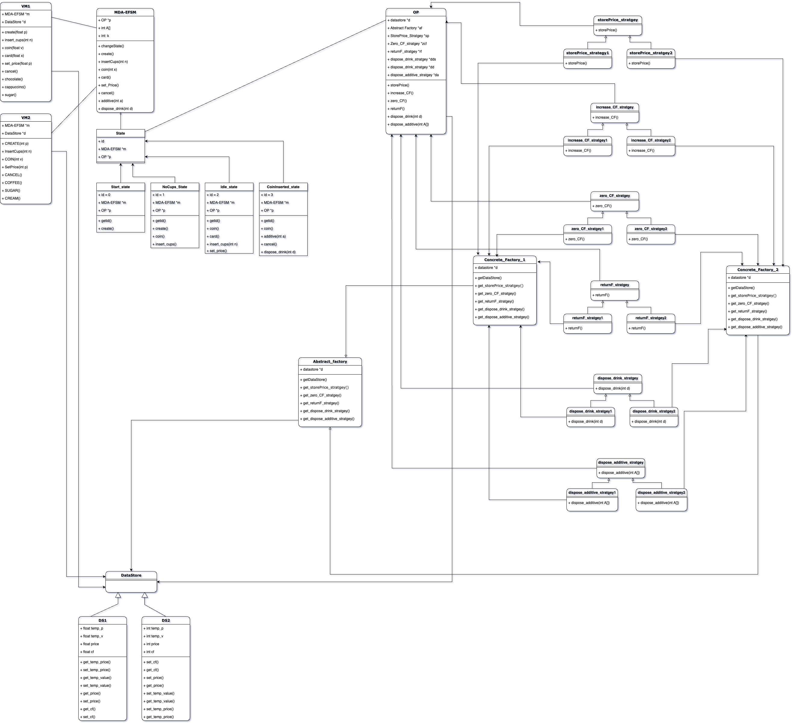

-----

# VendArch: A Pattern-Driven Vending Machine Architecture

> "Design patterns aren't just theory — VendArch puts them to work."

VendArch is an extensible, object-oriented C++ vending machine simulation framework. It's designed to demonstrate the practical application of classic software architecture design patterns by emulating multiple vending machine configurations through a clean separation of concerns.

-----

## ⚙️ Architectural Overview

VendArch integrates several key design patterns to create a scalable and modular software architecture:

  * **State Pattern (EFSM-based):** Enables event-driven state transitions within the vending machine's lifecycle (e.g., `Idle` → `NoCups` → `Ready` → `Dispensing`).
  * **Strategy Pattern:** Encapsulates algorithmic behaviors for core functionalities like storing prices, handling additives, returning coins, and dispensing drinks.
  * **Abstract Factory Pattern:** Facilitates product-line flexibility, allowing the system to seamlessly switch between different machine variants (e.g., **VM\_1**, **VM\_2**) without altering the core controller logic.

These patterns work together to enable runtime polymorphism, behavioral substitution, and configuration-level modularity.




-----

## 🧩 Component Layers

1.  **EFSM Controller**
    Implements the core event-driven logic. It encapsulates state classes (`IdleState`, `NoCupsState`, `HasFundsState`, etc.) and invokes actions through the `OutputProcessor` interface.

2.  **DataStore Abstraction**
    A polymorphic `DataStore` base class interfaces with concrete store implementations:

      * **DS1 (for VM\_1):** Supports floating-point values for prices and funds.
      * **DS2 (for VM\_2):** Enforces integer-only validation for all inputs.

3.  **Output Processor & Strategy Binding**
    The `OutputProcessor` delegates operations to pluggable strategy components, each with variant-specific implementations (e.g., `StorePrice1`, `DisposeDrink2`):

      * `StorePrice`, `SetPrice`
      * `DisposeDrink`, `ReturnCoins`, `HandleAdditives`

4.  **Abstract Factory (VMFactory)**
    This layer decouples machine instantiation from the system's operational core by defining abstract methods for producing concrete strategies and data stores.

      * **VM1\_Factory:** Binds **VM\_1** to floating-point logic.
      * **VM2\_Factory:** Binds **VM\_2** to integer-restricted logic.

-----

## 🛠️ Functional Capabilities

  * Initialize the vending machine (`Activate`)
  * Load cups into the machine
  * Set item prices using a validated strategy
  * Insert funds with runtime validation
  * Select drinks
  * Add or skip additives
  * Dispense drinks and return leftover funds
  * Handle invalid transitions using state constraints

-----

## 🧪 Testing & Extensibility

VendArch was built for extensibility and pedagogical clarity. You can extend the system by:

  * Adding new `DataStore` types.
  * Injecting new strategy behaviors.
  * Creating new machine variants (`VM_3`, `VM_4`, etc.) by implementing new Abstract Factories.

-----

## 🖥️ Technologies Used

  * **C++17**
  * **OOP & SOLID Principles**
  * **Design Pattern Architecture**
  * **CLI-based runtime interaction**

-----

## 📁 File Structure

```
/src
├── main.cpp
├── EFSM/                # State pattern logic
├── Factories/           # Abstract Factory and VM variants
├── DataStore/           # DS1, DS2 with polymorphic getters/setters
├── Strategies/          # Strategy pattern implementations
├── OutputProcessor/     # Behavior dispatcher
└── VendingMachines/     # VM_1 and VM_2 interfaces
```

-----

## 🔒 Input Validation

  * **VM\_1** allows for decimal (float) values for prices and funds.
  * **VM\_2** restricts all inputs to integers with hard validation.
  * Logical errors, such as selecting a drink when no cups are available, are prevented through state-based gating.

-----

## 🧠 Educational Value

VendArch serves as a practical model for understanding:

  * Layered architecture in system design.
  * Designing for extensibility and managing product variants.
  * Enterprise-grade decoupling using fundamental design patterns.

-----

## 🧾 License

This project is licensed under the **MIT License**.

-----

## 👨‍💻 Author

**Bravim Ketankumar Purohit**

  * Graduate Student, Illinois Institute of Technology
  * [LinkedIn](https://www.google.com/search?q=https://www.linkedin.com/in/bravim-purohit/)
